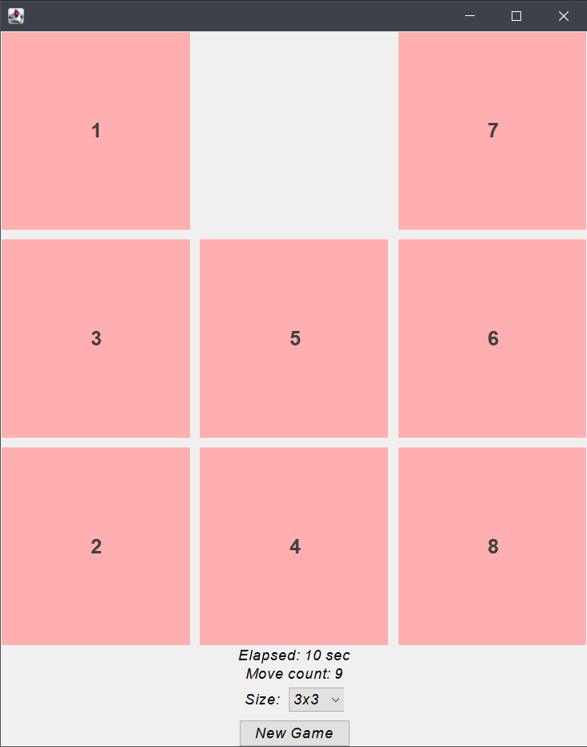
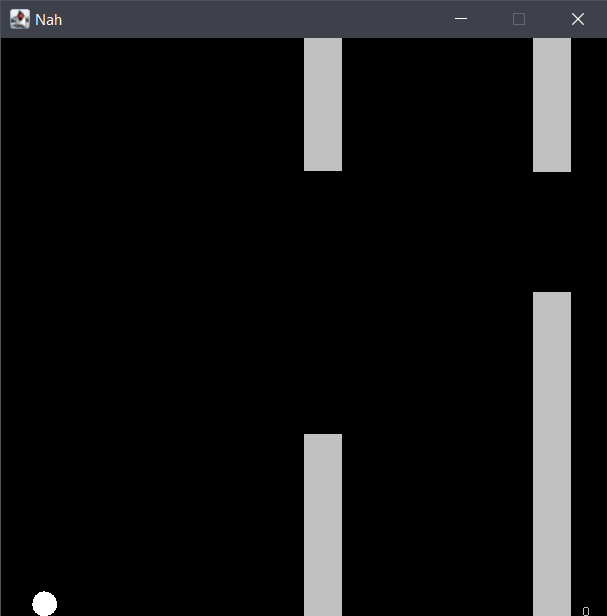
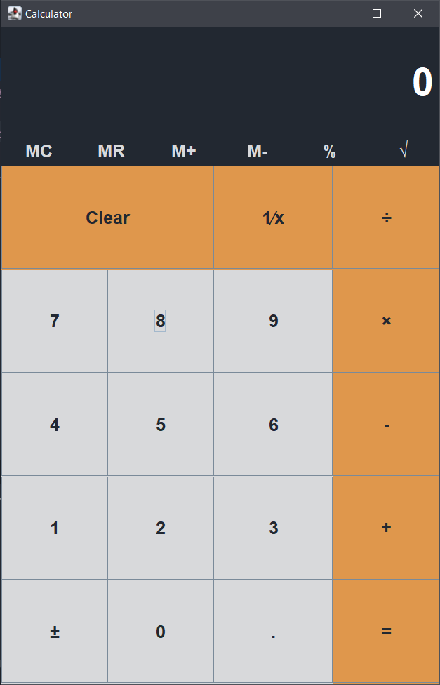

# FPT Java Swing
A Collection of projects I built in Java Desktop LAB Using OOP and MVC design pattern

## [Filteen Puzzle](https://github.com/ctmhoang/FPT-Java-Swing/tree/master/FifteenPuzzle)
[A sliding puzzle](https://en.wikipedia.org/wiki/15_puzzle), In order to win you need to place each tile in the increasing order.

  

## [FloopyBord]((https://github.com/ctmhoang/FPT-Java-Swing/tree/master/FloopyBord)) (A simple Flappy Bird Game)
A game that you control the ball inorder not to hit the Pipes :joy:

  

# [OODS Calculator](https://github.com/ctmhoang/FPT-Java-Swing/tree/master/OOP-CAL)

A Calulator Improved from Brian Holt Class :triumph: :yellow_heart: :yellow_heart: :yellow_heart:

  

